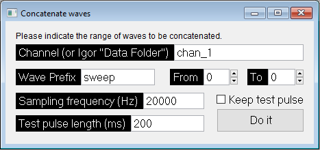

[](https://zenodo.org/badge/latestdoi/508459099)

# Igor Pro Tools for Electrophysiological Data

This repository contains tools for off-line processing of electrophysiological data acquired with Igor Pro.

Man Ho Wong (2022). University of Pittsburgh.

# concatenateWaves

This Igor Pro plug-in allows user to select a range of waves and concatenate them into one wave. The concatenated wave will be exported as an ibw file in the current folder.



For more info, see [here](concatenateWaves/README.md).

# getTransients

```
getTransients()
```

This Igor Pro procedure extracts the capacitance transients of every recording file listed in a file index provided by user.

For more info, see [here](getTransients/README.md).

# License

[GNU General Public License v3.0](LICENSE)

# Cite as

Wong, M. H. (2022). Igor Pro Tools for Electrophysiological Data (Version 1.0.0) [Computer software]. https://doi.org/10.5281/zenodo.7278355
